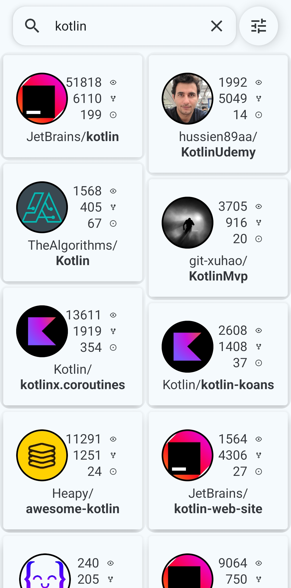
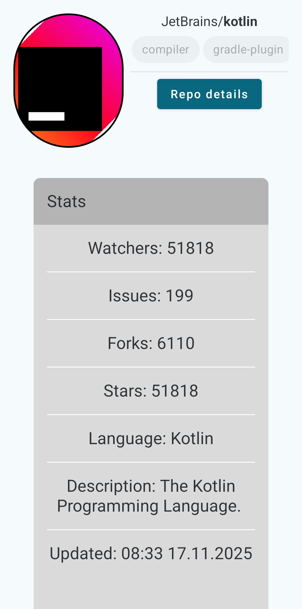
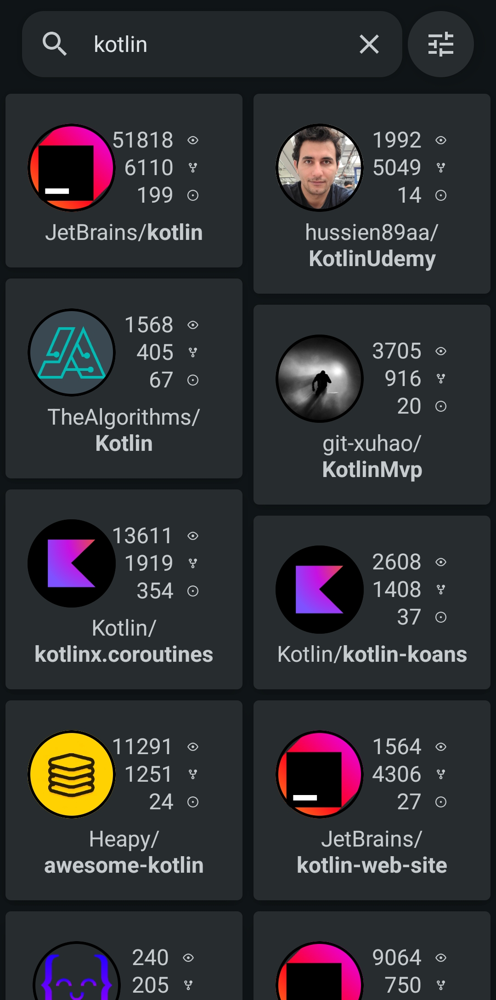
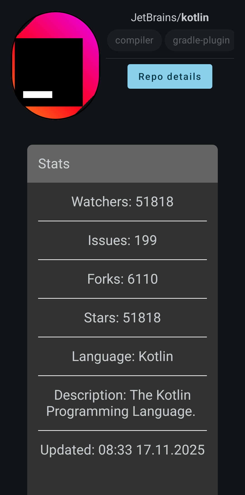

# GitHub App

# Tech stack & Open-source libraries
 - Minimum SDK level 24
 - Kotlin based, [Coroutines](https://github.com/Kotlin/kotlinx.coroutines) + [Flow](https://kotlinlang.org/docs/flow.html) for asynchronous
 - [Ktor](https://ktor.io/docs/welcome.html): Construct the REST APIs + [Kotlinx Serialization](https://github.com/Kotlin/kotlinx.serialization)
 - [SQLDelight](https://sqldelight.github.io/sqldelight/2.0.2/android_sqlite/): Typesafe Kotlin APIs for SQL database
 - [Coil](https://github.com/coil-kt/coil): An image loading library backed by Kotlin Coroutines
 - [Arrow](https://arrow-kt.io/) for error handling
 - [Gradle convention plugins](https://docs.gradle.org/current/samples/sample_convention_plugins.html)
 - Static analysis ([Ktlint](https://github.com/pinterest/ktlint) and [Detekt](https://github.com/detekt/detekt))
 - Tests: Unit + UI
 - CI/CD: [GitHub Actions](https://github.com/MatijaSokol/GitHubApp/actions)
 - [Versioning](release/version.properties)
- Jetpack
  - Lifecycle: Observe Android lifecycles and handle UI states upon the lifecycle changes
  - [ViewModel](https://developer.android.com/topic/libraries/architecture/viewmodel): Manages UI-related stuff, data holder and lifecycle aware. Allows data to survive configuration changes such as screen rotations
  - [Compose](https://developer.android.com/compose): Toolkit for building native UI
  - [Compose Navigation](https://developer.android.com/develop/ui/compose/navigation)
  - [Shared Element Transition](https://developer.android.com/develop/ui/compose/animation/shared-elements)
  - [Hilt](https://dagger.dev/hilt/) for dependency injection
  - [Splash Screen](https://developer.android.com/develop/ui/views/launch/splash-screen)

## How to run
- Find generated .apk file through [workflow](https://github.com/MatijaSokol/GitHubApp/actions/workflows/distribute_release_paid_prod_apk_artifact.yml) or trigger it to create new .apk

## Screenshots
<table width="100%">
  <tr>
    <td width="50%" align="center"><b>List screen (light)</b></td>
    <td width="50%" align="center"><b>Details screen (light)</b></td>
  </tr>
  <tr>
    <td width="50%" align="center">
    <td width="50%" align="center">
  </tr>
  <tr>
    <td width="50%" align="center"><b>List screen (dark)</b></td>
    <td width="50%" align="center"><b>Details screen (dark)</b></td>
  </tr>
  <tr>
    <td width="50%" align="center">
    <td width="50%" align="center">
  </tr>
</table>
