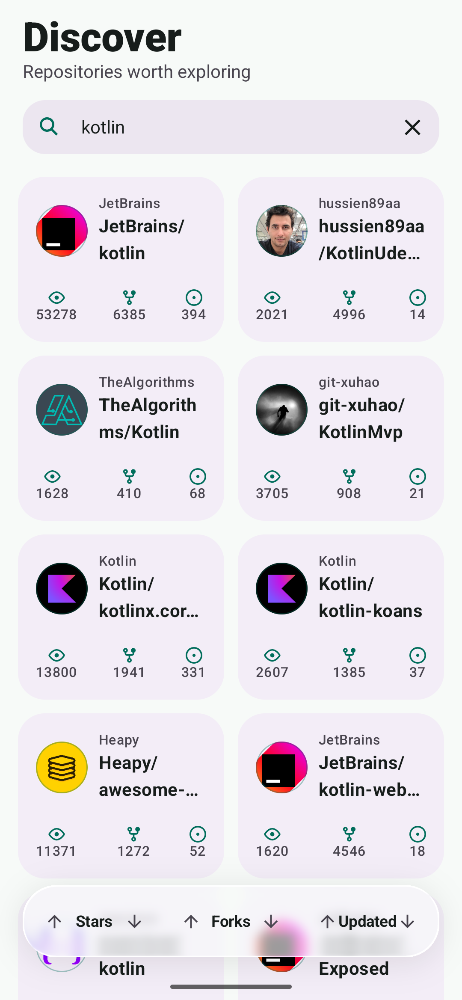
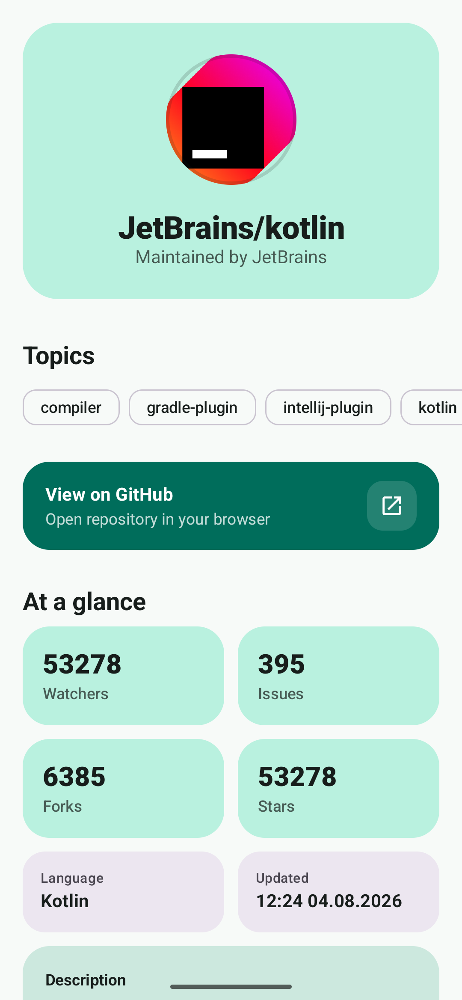
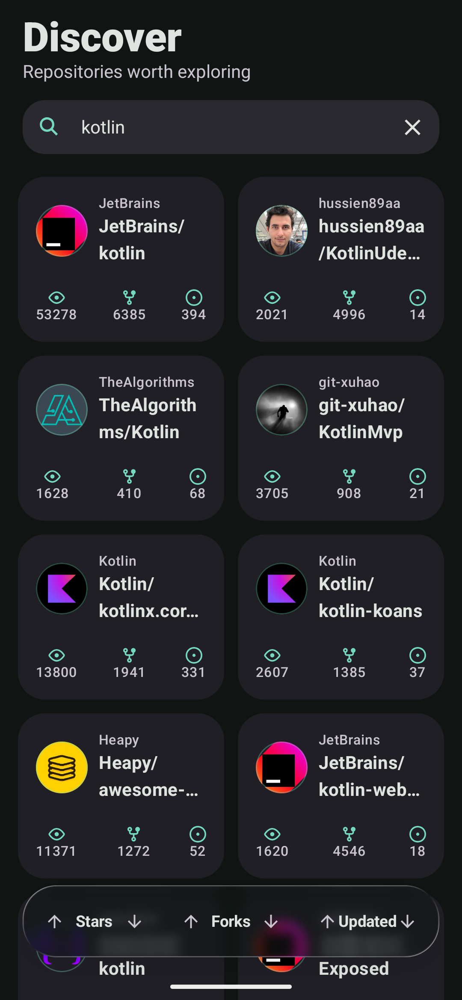
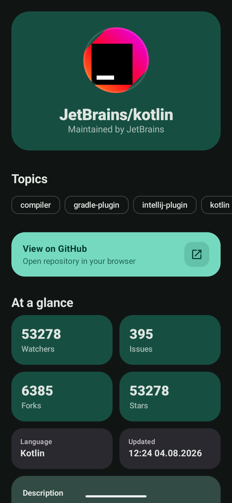

# GitHub App

GitHub App is a Kotlin Android application for searching and browsing GitHub repositories. It is built with
Jetpack Compose, Navigation 3, Hilt, Ktor, SQLDelight, and a clean multi-module architecture.

Users can search repositories, paginate through results, sort by stars,
forks, or last update date, open author profiles in the browser, and view repository details in the paid variant.

## Features

- Repository search powered by the GitHub REST API.
- Infinite pagination with refresh and append error states.
- Sort options for stars, forks, and update date.
- Repository detail screen with author, topic, stats, language, description, and external repository/profile links.
- Free and paid app modes. The free variant blocks the detail screen; the paid variant enables it.
- Light and dark theme.
- Shared element transitions between list and detail surfaces.
- Predictive back gesture support.
- SQLDelight database layer and datasource test fakes. Offline/local persistence is still a work in progress.
- Unit, Android, and Compose UI test coverage around domain logic, navigation, list, and detail flows.

## Screenshots

<table width="100%">
  <tr>
    <td width="50%" align="center"><b>List screen (light)</b></td>
    <td width="50%" align="center"><b>Details screen (light)</b></td>
  </tr>
  <tr>
    <td width="50%" align="center">
      
    </td>
    <td width="50%" align="center">
      
    </td>
  </tr>
  <tr>
    <td width="50%" align="center"><b>List screen (dark)</b></td>
    <td width="50%" align="center"><b>Details screen (dark)</b></td>
  </tr>
  <tr>
    <td width="50%" align="center">
      
    </td>
    <td width="50%" align="center">
      
    </td>
  </tr>
</table>

## Architecture

The project uses a multi-module setup with a small application module and feature/domain/data modules under `repo`.

```text
app/                     Application entry point, app-level Hilt setup, mode-specific sources, navigation
core/                    Shared Kotlin utilities, dictionary contract, errors, app mode
core-ui/                 Shared Compose components, navigation destination types, UI helpers
repo/
  domain/                Repository models, contracts, paginator contract, use cases
  datasource/            Ktor GitHub API client, network mapping, SQLDelight cache
  datasource-test/       Fakes and JSON fixtures for tests
  list/                  Repository list screen, ViewModel, UI tests
  detail/                Repository detail screen, ViewModel, UI tests
konsist/                 Project-wide Konsist architecture and naming tests
test/                    Shared test fixtures
build-logic/             Gradle convention plugins, quality setup, versioning tasks
```

Domain modules stay free of Android dependencies. Datasource modules implement domain contracts and can own DI
bindings for their implementations when the binding fits the module's platform and Hilt component. UI modules depend
on domain and shared UI helpers. Application-level setup, Android context providers, Android-specific Hilt components,
and composition decisions stay in `app`.

## Presentation Pattern

Feature screens follow an MVI-style structure:

- `*State` holds stable UI state, using immutable collections where lists are exposed to Compose.
- `*Event` models user input sent to a ViewModel through `onEvent`.
- `*Action` models one-shot effects such as navigation, browser launches, scroll requests, or messages.
- `*ViewModel` exposes state through `StateFlow` and actions through a `Channel.receiveAsFlow()`.
- `*UiMapper` maps domain/loading/error data into display-ready state and strings.

## Tech Stack

| Category | Technology                                                   |
|---|--------------------------------------------------------------|
| Language | Kotlin                                                       |
| Background work | Coroutines, Flow                                             |
| UI | Jetpack Compose, Material 3, Backdrop                        |
| Navigation | Navigation 3, Shared element transitions                     |
| Networking | Ktor, Kotlinx Serialization                                  |
| Local storage | SQLDelight (offline/local persistence is work in progress)   |
| Images | Coil                                                         |
| Dependency injection | Hilt                                                         |
| Error handling | Arrow                                                        |
| Testing | JUnit, MockK, Turbine, Kluent, Compose UI tests              |
| Quality | Ktlint, Detekt, Compose Detekt rules, Konsist architecture tests |
| Build | AGP, Gradle, convention plugins, version catalog, Kotlin DSL |

## Requirements

- Android Studio with JDK 21 configured.
- Minimum supported Android version: API 24.
- Compile SDK: API 37.
- Target SDK: API 37.

The Gradle wrapper is checked in, so local builds should use `./gradlew`.

## Build Variants

The application has two flavor dimensions:

| Dimension | Flavors |
|---|---|
| Environment | `dev`, `prod` |
| Mode | `free`, `paid` |

Gradle combines dimensions in environment-then-mode order, producing variants such as:

- `devFreeDebug`
- `prodFreeRelease`
- `devPaidDebug`
- `prodPaidRelease`

Mode behavior:

- `free` uses `com.matijasokol.githubapp.free`, shows the app name `GitHub App Free`, and blocks repository details.
- `paid` uses `com.matijasokol.githubapp`, shows the app name `GitHub App`, and enables repository details.

## Build and Run

Clone the repository and open it in Android Studio:

```bash
git clone https://github.com/MatijaSokol/GitHubApp.git
cd GitHubApp
```

Then sync Gradle and run one of the debug variants, for example `devPaidDebug` or `prodFreeDebug`.

Common Gradle commands:

```bash
# Build all debug variants
./gradlew assembleDebug

# Build release variants
./gradlew assembleRelease

# Build the same release variants used by CI
./gradlew assembleProdFreeRelease
./gradlew assembleProdPaidRelease

# Run unit tests
./gradlew test

# Run app and feature unit tests explicitly
./gradlew app:test repo:domain:test repo:list:test repo:detail:test konsist:test

# Run Konsist architecture tests
./gradlew konsist:test

# Static analysis and formatting checks
./gradlew ktlintCheck detekt

# Format Kotlin sources
./gradlew ktlintFormat
```

Release builds use the signing config in `release/` and read these environment variables:

```bash
export GITHUBAPP_STORE_PASSWORD=...
export GITHUBAPP_KEY_PASSWORD=...
```

## Data Notes

Network calls target `https://api.github.com` through Ktor. The current client does not attach a GitHub token,
so local usage is subject to GitHub's unauthenticated API rate limits. If list loading starts returning errors
after repeated searches, wait for the limit to reset or add authenticated API support before heavy testing.

The SQLDelight local database layer is present, but offline/local persistence behavior is still being built out.

## Versioning

App version values live in `release/version.properties` and are read by the custom `githubapp.versioning`
convention plugin.

Available versioning tasks include:

```bash
./gradlew printVersionName
./gradlew incrementMajor
./gradlew incrementMinor
./gradlew incrementPatch
./gradlew incrementBuild
```

## GitHub Actions

The repository uses GitHub Actions for pull request checks, release APK artifact generation, and version bump
automation.

Important workflows:

- `pr_checks.yml`: runs on pushes and pull requests targeting `master`, `develop`, or `release*`. It runs
  ktlint, detekt, release builds, and unit tests.
- `distribute_release_free_prod_apk_artifact.yml`: manual workflow that builds `prodFreeRelease`, renames the APK
  with the current version, and uploads it as an artifact.
- `distribute_release_paid_prod_apk_artifact.yml`: manual workflow that builds `prodPaidRelease`, renames the APK
  with the current version, and uploads it as an artifact.
- `increment_version.yml`: manual workflow that runs the selected version increment task and opens a pull request
  into `develop`.

The PR check workflow has four jobs:

- `static_analysis` runs `./gradlew ktlintCheck detekt --stacktrace`.
- `build_free` runs `./gradlew assembleProdFreeRelease --stacktrace`.
- `build_paid` runs `./gradlew assembleProdPaidRelease --stacktrace`.
- `unit_tests` runs unit tests for `app`, `repo:domain`, `repo:detail`, `repo:list`, and Konsist architecture tests.

Release artifact workflows require the signing secrets used by Gradle:

- `GITHUBAPP_STORE_PASSWORD`
- `GITHUBAPP_KEY_PASSWORD`

Dependabot is also configured to check Gradle and GitHub Actions dependencies monthly, with a maximum of five
open pull requests per ecosystem.

## Project Conventions

- Build configuration belongs in `build-logic/convention/`.
- Dependency versions belong in `gradle/libs.versions.toml`.
- Inter-module dependencies should use `projects.*` type-safe accessors.
- Resolve visible, formatted, and accessibility strings through `Dictionary` in UI mappers, then expose plain strings
  through UI state or UI models. Composables must not access string resources directly.
- At the screen boundary, pass child composables individual strings when they need up to three text values. Components
  needing more than three may receive the relevant text state/model, but should not receive the entire screen state.
- Let Compose infer stability for immutable state and UI models. Use `@Stable` only when inference is insufficient and
  the type genuinely satisfies the stability contract.
- Domain modules should remain pure Kotlin/JVM and free of Android, datasource, and UI dependencies.

## Konsist Architecture Checks

Konsist architecture tests live in `konsist/src/test/kotlin/com/matijasokol/githubapp/konsist` and inspect production sources with
`Konsist.scopeFromProduction()`. The current rules cover package layer dependencies, domain and datasource boundaries,
package naming and path matching, use case and ViewModel conventions, MVI companion declarations, UI model immutable
collections, datasource DTO naming/serialization, Compose placement, localized string access, data class immutability,
and wildcard imports.

When adding or changing a rule, prefer a focused test class and avoid checks that duplicate ktlint or detekt unless
Konsist adds project-specific value. Run `./gradlew konsist:test` locally, or `./gradlew test` to include Konsist with
the rest of the unit test lifecycle.

## Download

Release APKs are published from GitHub Actions artifacts and may also be available on the
[latest GitHub release](https://github.com/MatijaSokol/GitHubApp/releases/latest).

## License

This project is for educational and demo purposes.
