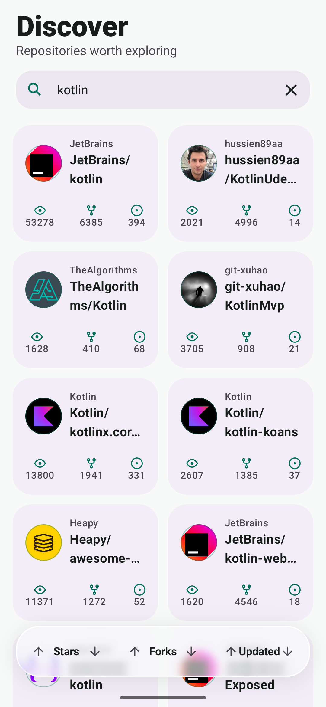
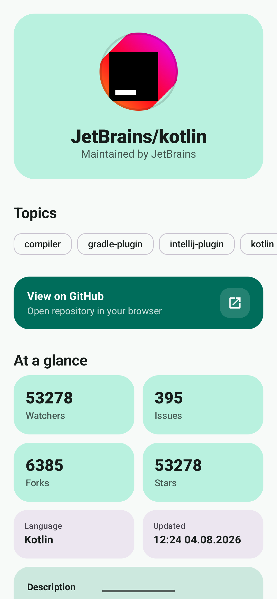
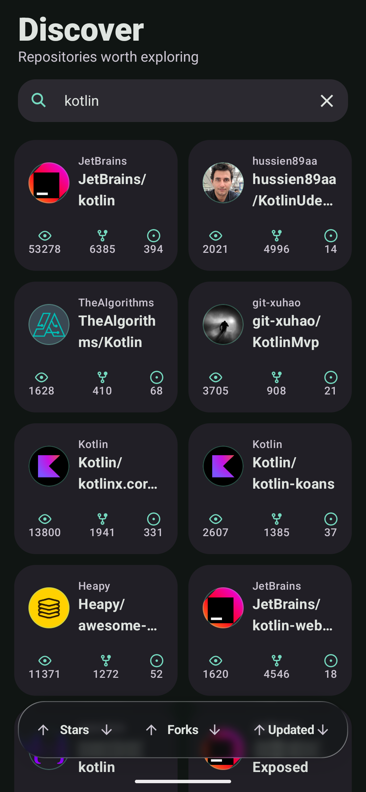
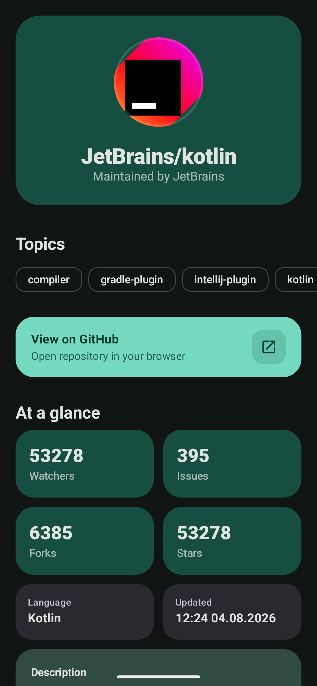

# GitHub App

GitHub App is a Kotlin Android application for searching and browsing GitHub repositories. It is built with
Jetpack Compose, Navigation 3, Hilt, Ktor, SQLDelight, and a clean multi-module architecture.

Users can search repositories, paginate through results, sort by stars,
forks, or last update date, open author profiles in the browser, and view repository details in the paid variant.

## Features

- Repository search powered by the GitHub REST API.
- Infinite pagination with refresh and append error states.
- Sort options for stars, forks, and update date.
- Repository detail screen with author, topic, stats, language, description, and external repository/profile links.
- Free and paid app modes. The free variant blocks the detail screen; the paid variant enables it.
- Light and dark theme.
- Shared element transitions between list and detail surfaces.
- Predictive back gesture support.
- SQLDelight database layer and datasource test fakes. Offline/local persistence is still a work in progress.
- Unit, Android, and Compose UI test coverage around domain logic, navigation, list, and detail flows.

## Screenshots

<table width="100%">
  <tr>
    <td width="50%" align="center"><b>List screen (light)</b></td>
    <td width="50%" align="center"><b>Details screen (light)</b></td>
  </tr>
  <tr>
    <td width="50%" align="center">
      
    </td>
    <td width="50%" align="center">
      
    </td>
  </tr>
  <tr>
    <td width="50%" align="center"><b>List screen (dark)</b></td>
    <td width="50%" align="center"><b>Details screen (dark)</b></td>
  </tr>
  <tr>
    <td width="50%" align="center">
      
    </td>
    <td width="50%" align="center">
      
    </td>
  </tr>
</table>

## Architecture

The project uses a multi-module setup with a small application module and feature/domain/data modules under `repo`.

```text
app/                     Application entry point, app-level Hilt setup, mode-specific sources, navigation
core/                    Shared Kotlin utilities, errors, app mode
core-ui/                 Shared Compose components, UiText, navigation destination types, UI helpers
repo/
  domain/                Repository models, contracts, paginator contract, use cases
  datasource/            Ktor GitHub API client, network mapping, SQLDelight cache
  datasource-test/       Fakes and JSON fixtures for tests
  list/                  Repository list screen, ViewModel, UI tests
  detail/                Repository detail screen, ViewModel, UI tests
konsist/                 Project-wide Konsist architecture and naming tests
test/                    Shared test fixtures
build-logic/             Gradle convention plugins, quality setup, versioning tasks
```

Domain modules stay free of Android dependencies. Datasource modules implement domain contracts and can own DI
bindings for their implementations when the binding fits the module's platform and Hilt component. UI modules depend
on domain and shared UI helpers. Application-level setup, Android context providers, Android-specific Hilt components,
and composition decisions stay in `app`.

## Presentation Pattern

Feature screens follow an MVI-style structure:

- `*State` holds stable UI state, using immutable collections where lists are exposed to Compose.
- `*Event` models user input sent to a ViewModel through `onEvent`.
- `*Action` models one-shot effects such as navigation, browser launches, scroll requests, or messages.
- `*ViewModel` exposes state through `StateFlow` and actions through a `Channel.receiveAsFlow()`.
- `*UiMapper` maps domain/loading/error data into UI state, retaining resource-backed text as unresolved `UiText`.

## Tech Stack

| Category             | Technology                                                                     |
|----------------------|--------------------------------------------------------------------------------|
| Language             | Kotlin                                                                         |
| Background work      | Coroutines, Flow                                                               |
| UI                   | Jetpack Compose, Material 3, Backdrop                                          |
| Navigation           | Navigation 3, Shared element transitions                                       |
| Networking           | Ktor, Kotlinx Serialization                                                    |
| Local storage        | SQLDelight (offline/local persistence is work in progress)                     |
| Images               | Coil                                                                           |
| Dependency injection | Hilt                                                                           |
| Error handling       | Arrow                                                                          |
| Logging              | `AppLogger` abstraction backed by Timber (debug builds only)                   |
| Testing              | JUnit, MockK, Turbine, Kluent, Compose UI tests                                |
| Quality              | Ktlint, Detekt, Compose Detekt rules, Android Lint, Konsist architecture tests |
| Build                | AGP, Gradle, convention plugins, version catalog, Kotlin DSL                   |

## Requirements

- Android Studio with JDK 21 configured.
- Minimum supported Android version: API 24.
- Compile SDK: API 37.
- Target SDK: API 37.

The Gradle wrapper is checked in, so local builds should use `./gradlew`.

## Build Variants

The application has two flavor dimensions:

| Dimension   | Flavors        |
|-------------|----------------|
| Environment | `dev`, `prod`  |
| Mode        | `free`, `paid` |

Gradle combines dimensions in environment-then-mode order, producing variants such as:

- `devFreeDebug`
- `prodFreeRelease`
- `devPaidDebug`
- `prodPaidRelease`

Mode behavior:

- `free` uses `com.matijasokol.githubapp.free`, shows the app name `GitHub App Free`, and blocks repository details.
- `paid` uses `com.matijasokol.githubapp`, shows the app name `GitHub App`, and enables repository details.

## Build and Run

Clone the repository and open it in Android Studio:

```bash
git clone https://github.com/MatijaSokol/GitHubApp.git
cd GitHubApp
```

Then sync Gradle and run one of the debug variants, for example `devPaidDebug` or `prodFreeDebug`.

Debug variants build without any extra setup. Release builds use the signing config in `release/` and need these
environment variables:

```bash
export GITHUBAPP_STORE_PASSWORD=...
export GITHUBAPP_KEY_PASSWORD=...
```

Common Gradle commands:

```bash
# Build all debug variants
./gradlew assembleDebug

# Build release variants (requires the signing environment variables above)
./gradlew assembleRelease

# Build the same release variants used by CI
./gradlew assembleProdFreeRelease
./gradlew assembleProdPaidRelease

# Run unit tests for every module and variant, including Konsist
./gradlew test

# Run app and feature unit tests explicitly
./gradlew app:test repo:domain:test repo:datasource:test repo:list:test repo:detail:test konsist:test

# Run Konsist architecture tests
./gradlew konsist:test

# Instrumented / Compose UI tests (needs a running device or emulator; not run in CI)
./gradlew app:connectedDevPaidDebugAndroidTest
./gradlew repo:list:connectedDebugAndroidTest repo:detail:connectedDebugAndroidTest

# Static analysis and formatting checks
./gradlew ktlintCheck detekt

# Android Lint (fails only on issues not in the module's lint-baseline.xml)
./gradlew lint

# Regenerate the Android Lint baselines
./gradlew updateLintBaseline

# Format Kotlin sources
./gradlew ktlintFormat

# Generate Compose compiler stability reports/metrics (output: <module>/build/compose_metrics)
./gradlew repo:list:assembleRelease -Pgithubapp.enableComposeCompilerReports=true
```

## Data Notes

Network calls target `https://api.github.com` through Ktor. The current client does not attach a GitHub token,
so local usage is subject to GitHub's unauthenticated API rate limits. If list loading starts returning errors
after repeated searches, wait for the limit to reset or add authenticated API support before heavy testing.

The SQLDelight local database layer is present, but offline/local persistence behavior is still being built out.

## Versioning

App version values live in `release/version.properties` and are read by the custom `githubapp.versioning`
convention plugin.

Available versioning tasks include:

```bash
./gradlew printVersion        # prints version name and version code
./gradlew printVersionName    # prints version name only (used by CI)
./gradlew incrementMajor      # X+1.0.0.1
./gradlew incrementMinor      # X.Y+1.0.1
./gradlew incrementPatch      # X.Y.Z+1.1
./gradlew incrementBuild      # X.Y.Z.B+1
```

## GitHub Actions

All workflows run on `ubuntu-latest` and share the JDK 21 + Gradle setup in `.github/actions/setup-build`.

| Workflow                                     | Runs on                                           | What it does                                                                 |
|----------------------------------------------|---------------------------------------------------|------------------------------------------------------------------------------|
| `pr_checks.yml`                              | PRs and pushes to `master`, `develop`, `release*` | Static analysis, release builds and tests (see below)                        |
| `claude.yml`                                 | `@claude` mention in an issue or PR               | Claude Code assistant                                                        |
| `claude-code-review.yml`                     | PR opened or updated                              | Automatic Claude review based on `AGENTS.md` (skips fork and Dependabot PRs) |
| `distribute_release_*_prod_apk_artifact.yml` | Manual                                            | Builds the free/paid release APK with the version in its name                |
| `increment_version.yml`                      | Manual                                            | Bumps the app version and opens a PR into `develop`                          |

`pr_checks.yml` jobs run in parallel and upload their reports even when they fail:

| Job               | Command                                        | Artifact                                  |
|-------------------|------------------------------------------------|-------------------------------------------|
| `static-analysis` | `./gradlew ktlintCheck detekt lint --continue` | `static-analysis-reports`                 |
| `build-free`      | `./gradlew assembleProdFreeRelease`            | `app-prod-free-release.apk` (kept 2 days) |
| `build-paid`      | `./gradlew assembleProdPaidRelease`            | `app-prod-paid-release.apk` (kept 2 days) |
| `unit-test`       | `./gradlew test` (includes Konsist)            | `unit-test-reports`                       |

Android Lint fails only on issues missing from the module's `lint-baseline.xml`. Regenerate the baselines with
`./gradlew updateLintBaseline` only when intentionally accepting existing issues.

Dependabot checks Gradle and GitHub Actions dependencies monthly and groups Compose updates into one PR.

Required repository secrets:

- `GITHUBAPP_STORE_PASSWORD`, `GITHUBAPP_KEY_PASSWORD`: release signing (also add them as Dependabot secrets).
- `CLAUDE_CODE_OAUTH_TOKEN`: Claude workflows. Generate it with `claude setup-token` and install the
  [Claude GitHub app](https://github.com/apps/claude) on the repository.

## Project Conventions

- Build configuration belongs in `build-logic/convention/`.
- Dependency versions belong in `gradle/libs.versions.toml`.
- Inter-module dependencies should use `projects.*` type-safe accessors.
- Represent resource-backed visible, formatted, accessibility, and one-shot message text as `UiText` in UI state or
  actions. The flow is `strings.xml` → `UiText.StringResource` → state/action → UI-boundary resolution.
- Resolve `UiText` with the active Compose configuration immediately before rendering, or with current `Resources` for
  non-Compose consumers such as Toasts. Mappers and ViewModels must not resolve or cache localized strings. Dynamic
  values such as queries, URLs, repository names, and navigation arguments remain ordinary values.
- Feature code must not call `stringResource` directly; `stringResource` is confined to `UiText`. Direct
  `Resources` access is limited to `UiText` and the app-level one-shot message boundary in `AppContent`.
- At the screen boundary, pass child composables individual strings when they need up to three text values. Components
  needing more than three may receive the relevant text state/model, but should not receive the entire screen state.
- Let Compose infer stability for immutable state and UI models. Use `@Stable` only when inference is insufficient and
  the type genuinely satisfies the stability contract.
- Wrap Compose previews in `GitHubAppPreviewContent` from `core-ui`. Use a direct `@Preview` with a
  `PreviewParameterProvider` for screen state variants, and the shared device, theme, and large-font annotations for
  focused configuration checks rather than combining every state and configuration. Keep preview functions private,
  suffix their names with `Preview`, and use deterministic feature-owned fixtures instead of ViewModels, navigation,
  network access, or runtime services.
- Domain modules should remain pure Kotlin/JVM and free of Android, datasource, and UI dependencies.

## Konsist Architecture Checks

Konsist architecture tests live in `konsist/src/test/kotlin/com/matijasokol/githubapp/konsist`. Architecture and
naming rules inspect production sources with `Konsist.scopeFromProduction()`; hygiene and test rules inspect the whole
project, tests included, with `Konsist.scopeFromProject()`. The current rules cover package layer dependencies, domain
and datasource boundaries, datasource contract implementations, package naming and path matching, use case conventions
(`UseCase` suffix, `operator fun invoke` as the single public declaration, constructor parameters named after their
type), ViewModel conventions (single constructor, no `Navigator` dependency, `onEvent` as the only public entry point,
constructor parameters named after their type except Hilt `@Assisted` ones), MVI companion declarations, UI model
immutable collections, datasource DTO naming/serialization, Compose placement, `UiText`-only resource resolution, data
class immutability, and wildcard imports.

They also enforce test coverage and hygiene: every ViewModel and use case has a `<ClassUnderTest>Test` class with a
class-level `sut` property, unit-test source sets use JUnit Jupiter instead of JUnit 4 (`androidTest` is exempt), and
the codebase has no `m`-prefixed fields, no `android.util.Log` imports, no Timber imports outside `app`'s logging setup
(log through `AppLogger` instead), and no empty `.kt` files.

When adding or changing a rule, prefer a focused test class and avoid checks that duplicate ktlint or detekt unless
Konsist adds project-specific value. Run `./gradlew konsist:test` locally, or `./gradlew test` to include Konsist with
the rest of the unit test lifecycle.

## Download

Release APKs are published from GitHub Actions artifacts and may also be available on the
[latest GitHub release](https://github.com/MatijaSokol/GitHubApp/releases/latest).

## License

This project is for educational and demo purposes.
